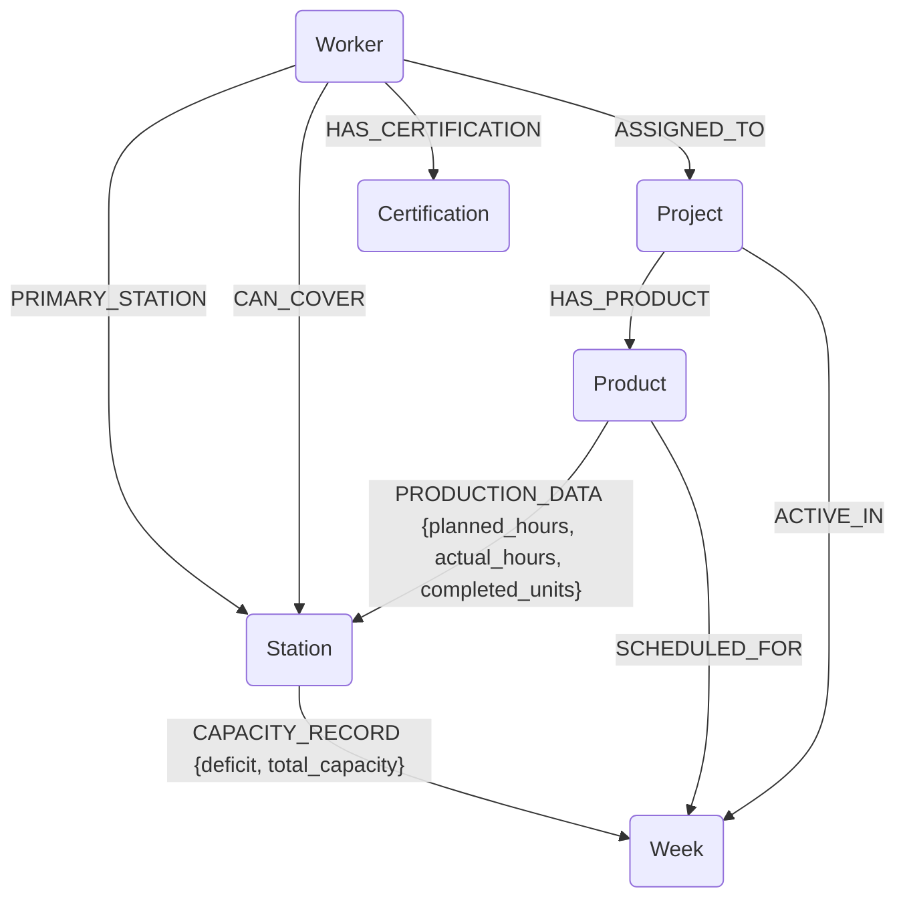

# Factory Production Graph Schema

### Node Labels
1. **Project**: `id`, `number`, `name`
2. **Product**: `type`, `unit`, `quantity`
3. **Station**: `code`, `name`
4. **Worker**: `id`, `name`, `role`, `type`
5. **Week**: `id`
6. **Certification**: `name`

### Relationship Types
1. `HAS_PRODUCT`: Links a project to the products it produces.
2. `PRODUCTION_DATA`: **(Carries data)** Links Product to Station. Properties: `planned_hours`, `actual_hours`, `completed_units`, `week`.
3. `SCHEDULED_FOR`: Links Product/Project to a specific Week.
4. `PRIMARY_STATION`: Links a Worker to their main station.
5. `CAN_COVER`: Links a Worker to other stations they are qualified to operate.
6. `HAS_CERTIFICATION`: Links a Worker to their certifications.
7. `CAPACITY_RECORD`: **(Carries data)** Links Station to Week. Properties: `deficit`, `total_capacity`, `total_planned`.
8. `ASSIGNED_TO`: Links a Worker to a Project they are working on.
9. `ACTIVE_IN`: Links a Project to the weeks it is running.
